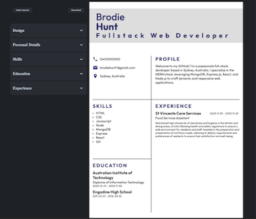
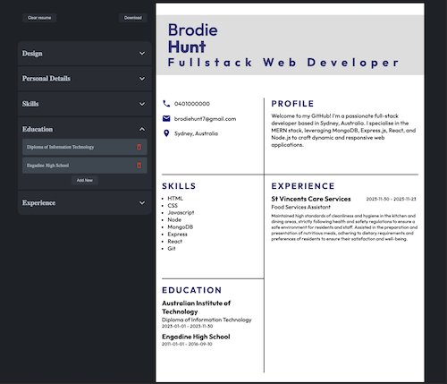

# CV builder - React application
This is a CV Builder react application. The purpose of this app is to provide a simple way to design and scaffold your CV. Simply choose a template, a theme, and enter your information to have your own CV ready to download. 
- by Brodie Hunt

## Table of contents

- [Overview](#overview)
  - [Links](#links)
  - [The challenge](#the-challenge)
  - [Screenshot](#screenshot)
- [My process](#my-process)
  - [Built with](#technologies)
  - [What I learned](#what-i-learned)
 

### Links

- Solution URL: [Github](https://github.com/brodiehunt/cv-builder)
- Live Site URL: [CV-builder](https://brodiehunt-cv-builder.netlify.app/)

## Overview

### The challenge

Users should be able to:

- Enter their details through the multiple forms provided.
- Choose style themes for the resume. Color, layout and typography.
- View an 'unchanging' resume scaffold independant of screen size (whilst still remaining responsive)
- Add, delete and edit items from each section of the resume.
- View their resume as they update it. 
- download the resume. 

### Screenshot

## My process

### Technologies
- HTML
- CSS
- React
- Material UI icons

### What I learned

- How to create controlled Form Components, implementing the 'useState' hook.
- How to pass props to children components. 
- How and why you should raise the state of components to the their parents. A few places I found it necessary to raise the state into the parent component:
    - Form input. Managing the individual input elements state in their parent form component, and passing the state down to the input. 
    - The accordion component. Lifting the state from the children of the accordion to the accordion component allowed me to implement an 'exclusive open' accordion. 
    - To represent and display the submitted form data on the Page component, the state of all 'saved' data was managed in the top level app component. 
- Talk about how to convert html and css into a pdf here

